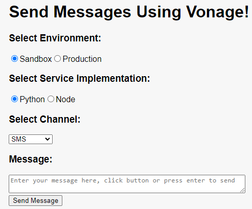

# Demo to Send Messages using Vonage

This project used Vonage SDK and Sandbox to send text messages in all supported channels (SMS, WhatsApp, Facebook, Instagram & Viber).
It has a frontend build in React and two backend service implementations (Python & Node).

To use it you'll need a Vonage account. Sign up for free at [vonage.com](https://dashboard.nexmo.com/sign-up).
To run it on Sanbox you'll need to configure desired channels in the [dashboard](https://dashboard.nexmo.com/messages/sandbox).
To run it in Production you'll need to configure the channel(s) as described in the [docs](https://developer.vonage.com/en/messages).

This is a monorepo.

ToDo:

1. Support other message types
2. Include (2FA) Autentication
3. Build another frontend to implement conversations using Webhooks

